

  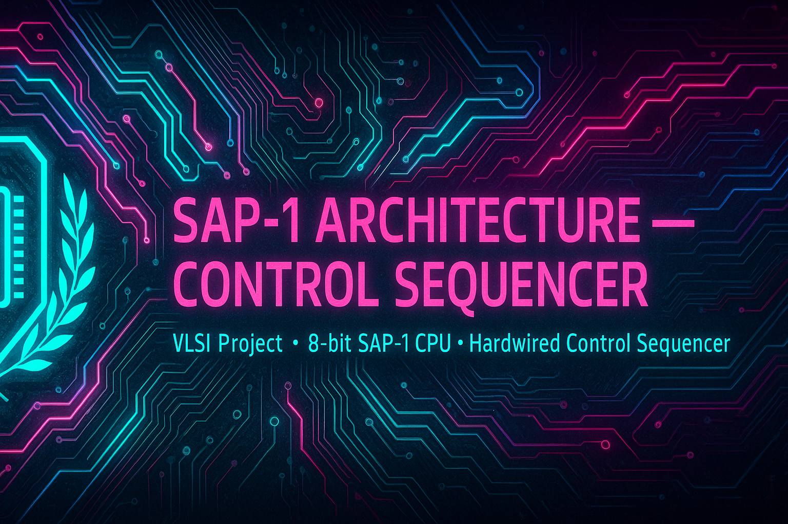

<h1 align="center">Control Sequencer · SAP-1 Architecture (Logisim Evolution)</h1>

  <strong>Chittagong University of Engineering and Technology (CUET)</strong> 
  <em>8-bit SAP-1 CPU with hardwired control, dual operation modes, and web-based assembler</em>

---

## 🎥 Video Tutorials

▶️ **[Watch the SAP-1 Video Tutorial](https://youtu.be/lHXzSBnS1Mc)**  
A complete walkthrough of the design, control sequencing, and program execution.

---

## 📚 Table of Contents
- [Project Overview](#project-overview)
- [Objectives](#objectives)
- [Key Features](#key-features)
- [Architecture and Functional Block Analysis](#architecture-and-functional-block-analysis)
  - [System Architecture Overview](#system-architecture-overview)
  - [Register Implementation (A, B)](#register-implementation-a-b)
  - [Program Counter (PC) Implementation](#program-counter-pc-implementation)
  - [Memory System and Address Register](#memory-system-and-address-register)
  - [Instruction Register and Opcode Decoder](#instruction-register-and-opcode-decoder)
  - [Arithmetic Logic Unit (ALU) Implementation](#arithmetic-logic-unit-alu-implementation)
  - [Boot/Loader Counter and Phase Generation](#bootloader-counter-and-phase-generation)
- [Control Logic Design](#control-logic-design)
  - [Timing & Universal Fetch](#timing--universal-fetch)
  - [Representative Execute Sequences](#representative-execute-sequences)
  - [Automatic Operation Control Logic](#automatic-operation-control-logic)
  - [Manual/Loader Operation Control](#manualloader-operation-control)
- [Instruction Set Architecture](#instruction-set-architecture)
  - [Instruction Encoding Scheme](#instruction-encoding-scheme)
  - [Assembler](#assembler)
- [Operation](#operation)
  - [Fetch–Decode–Execute Cycle](#fetchdecodeexecute-cycle)
  - [Running the CPU in Manual Mode](#running-the-cpu-in-manual-mode)
  - [Running the CPU in Automatic Mode (JMP + ADD Program)](#running-the-cpu-in-automatic-mode-jmp--add-program)
- [Future Improvement](#future-improvement)
- [Conclusion](#conclusion)

---

## Project Overview

This repository contains an enhanced **8-bit SAP-1** computer designed in **Logisim Evolution** with **hardwired control** and an extended instruction set (**LDA, LDB, ADD, SUB, STA, JMP, HLT**, plus shift/rotate variants). The system supports:

- **Automatic Mode**: fully timed fetch–decode–execute cycle.
- **Manual/Loader Mode**: safe ROM→RAM program transfer.

A dedicated control sequencer manages bus access and phase timing. A **web-based assembler** generates Logisim-compatible hex images. Multiple demo programs validate instruction behavior, memory operations, and overall timing—making this a reliable educational platform for computer architecture.

---

## Objectives

- Build an improved **SAP-1 (8-bit)** CPU for teaching and system-level analysis.
- Use a **single-bus** architecture with 8-bit datapath, 4-bit address space (16 bytes), and a **hardwired control** sequencer.
- Provide **Automatic** (T1–T6 ring counter + opcode decoder) and **Manual/Loader** modes for safe RAM programming.
- Implement a datapath with **A/B registers**, **ripple-carry ALU** (ADD/SUB), **4-bit PC** (increment/load), **MAR**, **16×8 SRAM**, and **Instruction Register**, ensuring strict **single-driver** bus discipline.

---

## Key Features

- **8-bit CPU architecture** using a unified single bus.
- **Dual operation modes**: stepwise/manual loading and automatic execution.
- **Register set**: A and B for ALU operations and temporary storage.
- **Program Counter**: increment and direct-load (JMP) capability.
- **Memory subsystem**: MAR + SRAM with controlled read/write.
- **IR + opcode decoder**: clean separation of opcode and operand paths.
- **ALU**: 8-bit addition/subtraction with tri-state bus output.
- **Control**: timing generator (T1–T6), precise phase-based sequencing.
- **Upgradeable ISA**: baseline instructions plus shifts/rotates.
- **Educational focus**: clear visualization and reproducible experiments in Logisim.

---

## Architecture and Functional Block Analysis

### System Architecture Overview

A **single-bus** design with **8-bit datapath** is controlled via tri-state sources. Only one driver is active per T-state (e.g., `pc_out, sram_rd, ins_reg_out_en, a_out, b_out, alu_out, sh_out`). Sinks such as `mar_in_en, ins_reg_in_en, a_in, b_in, sram_wr` latch data as needed.

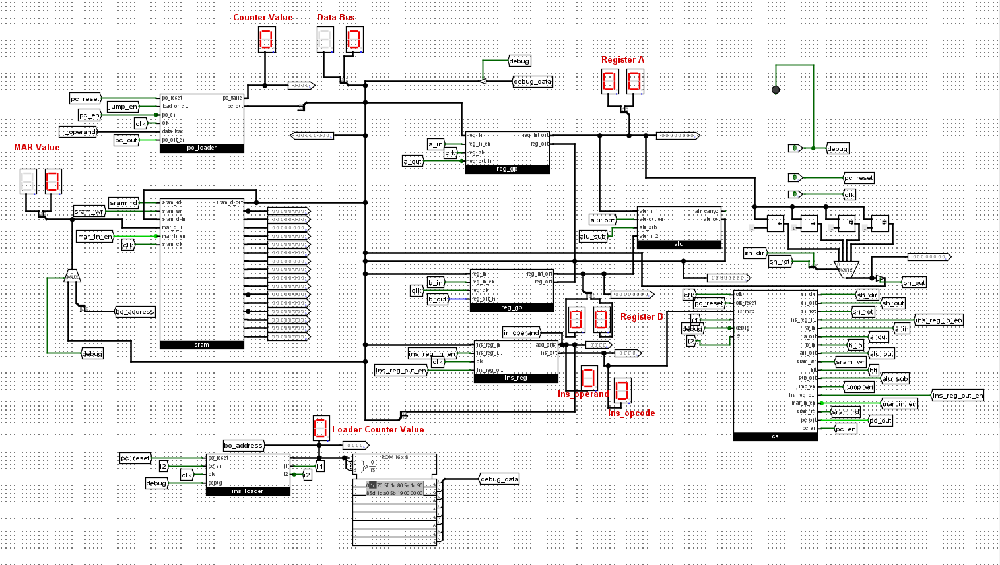  
*Figure 1: Automatic mode control sequencer—fetch–decode–execute timing.*

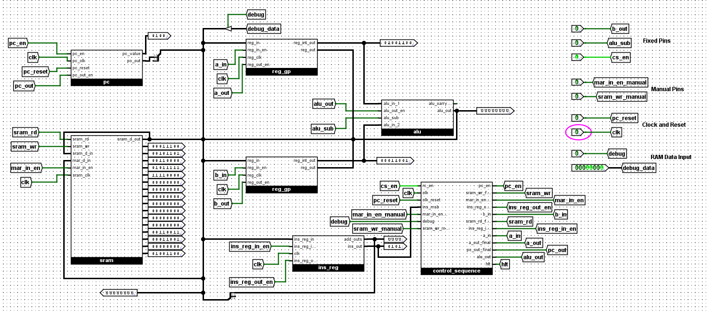  
*Figure 2: Manual/Loader mode sequencer—secure program loading with handshake.*

### Register Implementation (A, B)

**A/B registers** (`reg_gp`) store 8-bit values and expose:
1. **Input** from the bus via `a_in`, `b_in`.
2. **Output** onto the bus via `a_out`, `b_out` (tri-state).
3. **Internal** ALU connections via `reg_int_out` (bus-bypass).

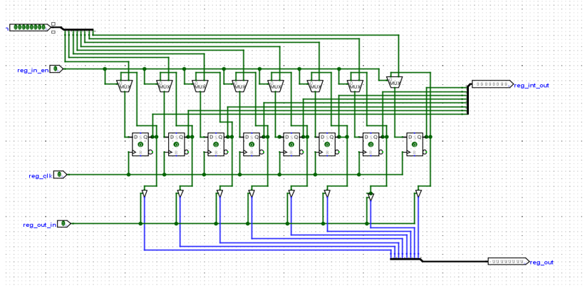  
*Figure 3: A/B register interfaces—input, output, and internal ALU path.*

### Program Counter (PC) Implementation

Two operating modes:

- **Increment** (T3, `pc_en = 1`): **PC ← PC + 1** for sequential fetch.
- **Jump** (JMP, T4, `jump_en = 1`): load **PC ← IR[3:0]** from bus.

At **T1**, `pc_out = 1` drives PC to the bus; **MAR** latches the address.

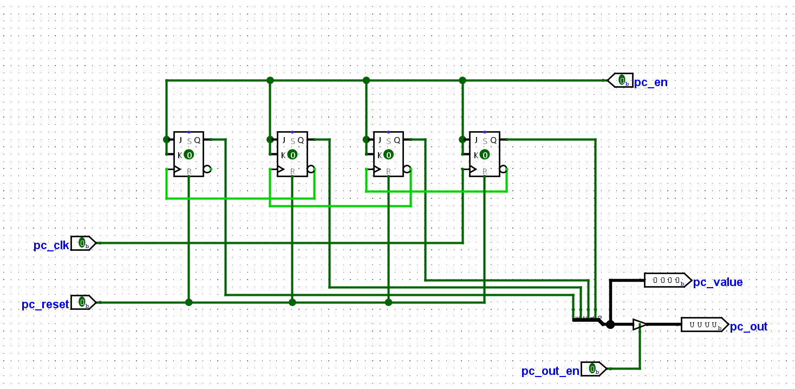  
*Figure 4: PC increment and jump behavior.*

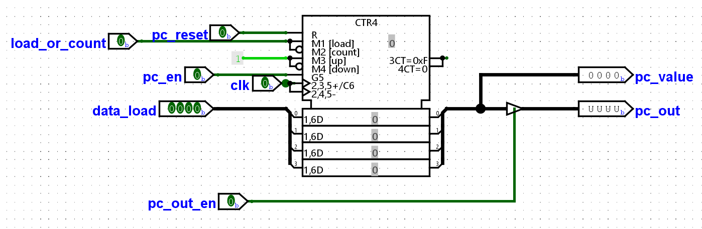  
*Figure 5: PC direct-load and sequential operation.*

### Memory System and Address Register

**MAR (4-bit)** latches addresses from the bus under `mar_in_en`.

- **Fetch** (T1): `pc_out` + `mar_in_en` → **MAR ← PC**.
- **Operand** (T4 for LDA/LDB/STA/JMP): `ins_reg_out_en` + `mar_in_en` → **MAR ← IR[3:0]**.

**SRAM** modes:
- **Read**: `sram_rd = 1` places **M[MAR]** on the bus (T2 for opcode, T5 for LDA/LDB).
- **Write**: `sram_wr = 1` writes bus data into **M[MAR]** (T5 for STA).

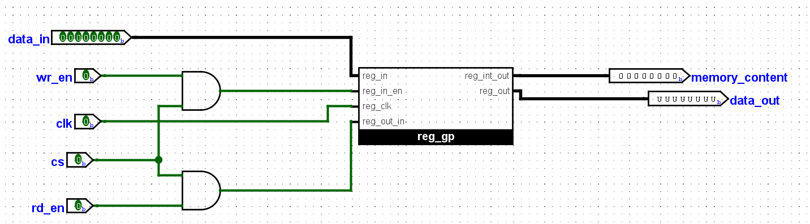  
*Figure 6: Register-based memory element and control pins.*

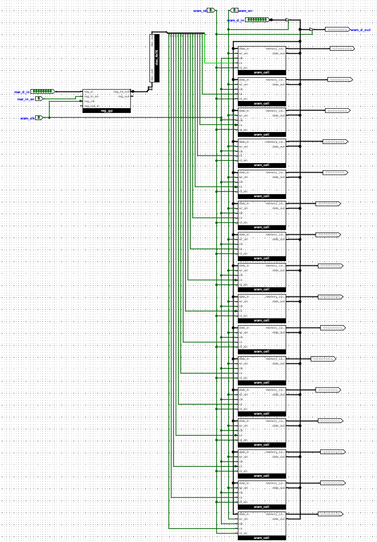  
*Figure 7: MAR timing and SRAM read/write sequencing.*

### Instruction Register and Opcode Decoder

**IR** supports instruction storage and operand forwarding:

1. **Load** (T2): `sram_rd = 1` and `ins_reg_in_en = 1` → **IR ← M[MAR]**.
2. **Opcode**: **IR[7:4]** drives the opcode decoder (`ins_tab`) to one-hot lines (e.g., `insLDA, insLDB, insADD, insSUB, insSTA, insJMP, insHLT`).
3. **Operand**: **IR[3:0]** can be driven to the bus via `ins_reg_out_en` (e.g., at T4).

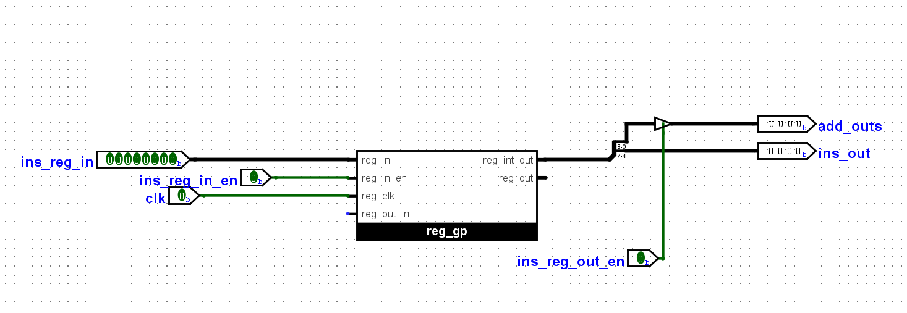  
*Figure 8: IR load, opcode routing, and operand forwarding.*

### Arithmetic Logic Unit (ALU) Implementation

- **Inputs**: A and B internal outputs (`reg_int_out`)—no bus needed.
- **Mode**: `alu_sub = 1` → A − B, else A + B.
- **Timing**: At **T4**, `alu_out = 1` (and `alu_sub` if SUB) drives bus; **A** latches result.
- **Micro-architecture**: 8-bit ripple-carry adder with mode control.

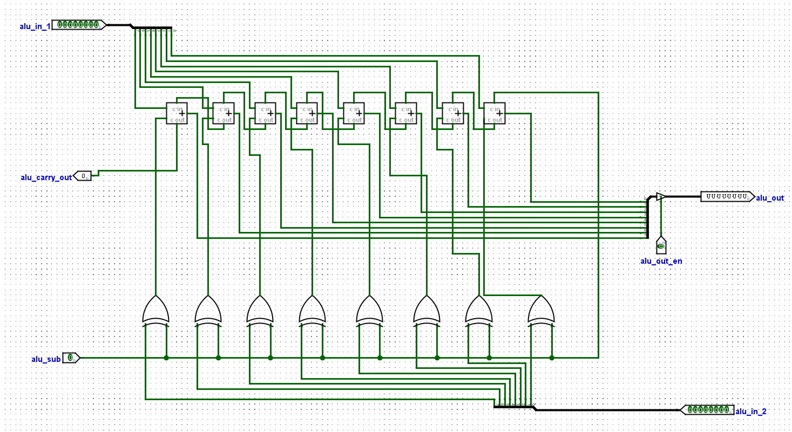  
*Figure 9: Ripple-carry ALU with tri-state bus interface.*

### Boot/Loader Counter and Phase Generation

**ins_loader** moves ROM→RAM in **Manual/Loader mode**:

1. **Role**: When `debug = 1`, normal CPU control is masked; loader writes program into RAM.
2. **Inputs**: `clk, bc_reset, bc_en, debug`.
3. **Addressing**: 4-bit **CTR4** increments to produce `bc_address[3:0]`.
4. **Phases**: Two **non-overlapping** phases (Φ, ¬Φ) via D-FF with inversion to avoid contention.

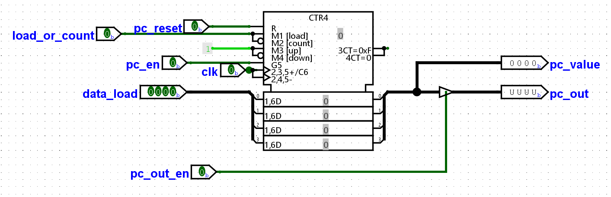  
*Figure 10: Boot/loader with sequential addressing and dual phases.*

---

## Control Logic Design

The control unit transforms decoded instructions and T-states into **precise control pulses** to:
1. Guarantee **exclusive bus drivers** at any instant.
2. Trigger **correct latching** across the datapath.

Key elements:
- **Ring Counter (RC)**: generates **T1–T6**.
- **Opcode Decoder**: instruction-specific micro-ops.
- **Mode Inputs**: `debug` (manual/loader), `i1/i2` (handshake) → **CPU mode = ~debug**, with loader masking via **~i2**.

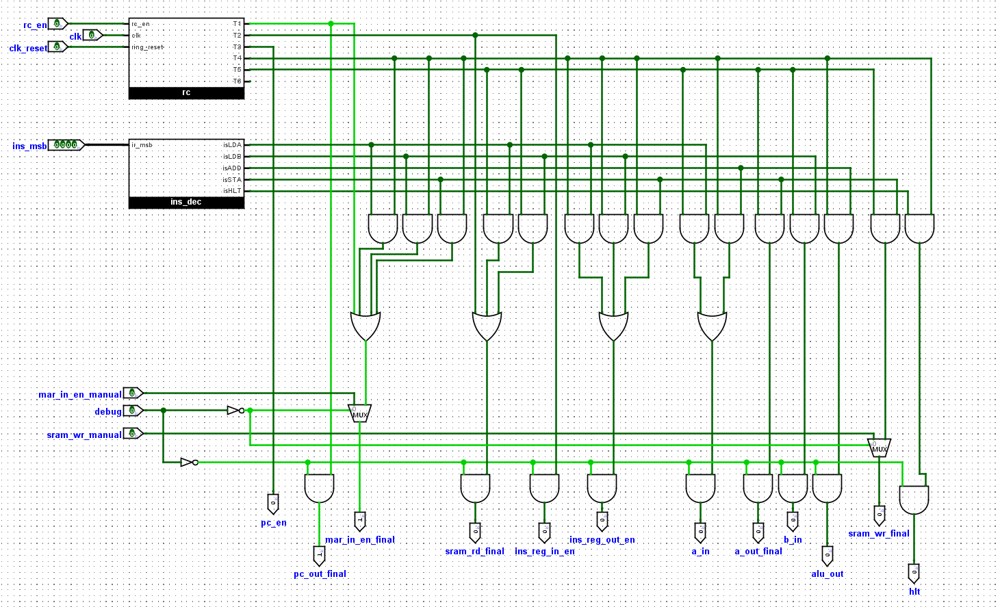  
*Figure 11: Manual mode control sequencer.*

Manual mode provides a minimal path (e.g., ADD) for stepwise verification.

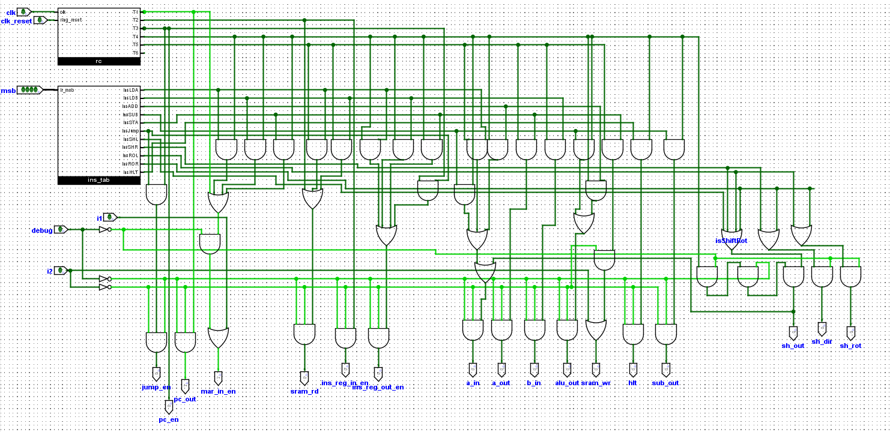  
*Figure 12: Automatic mode control sequencer.*

Automatic mode runs the full fetch–decode–execute cycle (ADD, SUB, JMP) with tight bus utilization.

### Timing & Universal Fetch

A 6-phase **ring counter** orchestrates micro-operations.

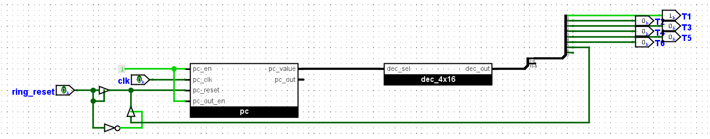  
*Figure 13: Six-phase ring counter (T1–T6).*

**Universal Fetch (all instructions)**

| T-state | Signals & Action                 | Effect              |
|:------:|-----------------------------------|---------------------|
| T1     | `pc_out`, `mar_in_en`             | MAR ← PC            |
| T2     | `sram_rd`, `ins_reg_in_en`        | IR ← M[MAR]         |
| T3     | `pc_en`                           | PC ← PC + 1         |

### Representative Execute Sequences

- **LDA addr**  
  - T4: **IR[3:0]** → MAR (via `ins_reg_out_en`, `mar_in_en`)  
  - T5: **A ← M[MAR]** (via `sram_rd`, `a_in`)
- **ADD**  
  - T4: **ALU drives bus (A + B)**; A latches
- **SUB**  
  - T4: **ALU drives bus (A − B)** (`alu_sub = 1`); A latches
- **JMP addr**  
  - T4: **PC ← IR[3:0]**

### Automatic Operation Control Logic

Define `C = ~debug` (CPU active), `L = ~i2` (loader idle). These coordinate the automatic fetch–decode–execute cycle.

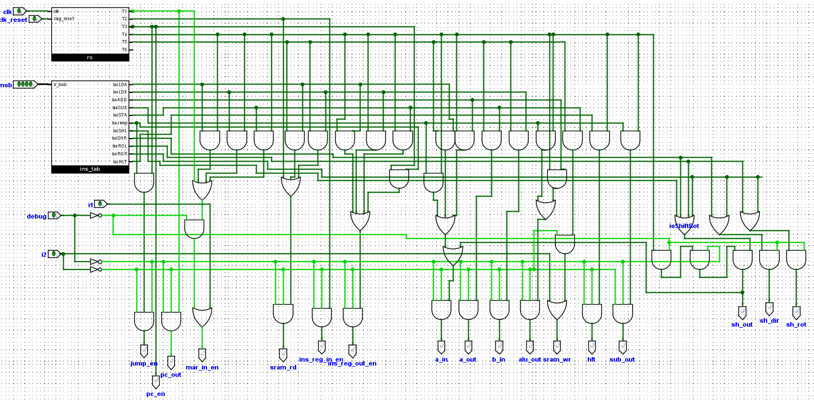  
*Figure 14: Automatic mode—sequencing and gating.*

**Fetch Control Equations**

| Signal        | Equation                                                         |
|---------------|------------------------------------------------------------------|
| `pc_out`      | `T1 & C`                                                         |
| `mar_in_en`   | `(T1 & C) \| (T4 & C & (insLDA \| insLDB \| insSTA \| insJMP))` |
| `sram_rd`     | `(T2 & C) \| (T5 & C & (insLDA \| insLDB))`                      |
| `ins_reg_in_en` | `T2 & C`                                                       |
| `pc_en`       | `T3 & C`                                                         |

**ALU and Register Control Equations**

| Signal   | Equation                                           |
|----------|----------------------------------------------------|
| `alu_out`| `T4 & C & (insADD \| insSUB)`                      |
| `alu_sub`| `T4 & C & insSUB`                                  |
| `a_in`   | `(T5 & C & insLDA) \| (T4 & C & (insADD \| insSUB))`|
| `b_in`   | `T5 & C & insLDB`                                  |
| `a_out`  | `(T4 & C & (insADD \| insSUB)) \| (T5 & C & insSTA)`|
| `b_out`  | `T4 & C & (insADD \| insSUB)`                      |

### Manual/Loader Operation Control

When **`debug = 1`**, normal CPU control is masked. A simple handshake moves code safely into RAM:

- **`i1`**: enable MAR address load.  
- **`i2`**: enable **SRAM write**.

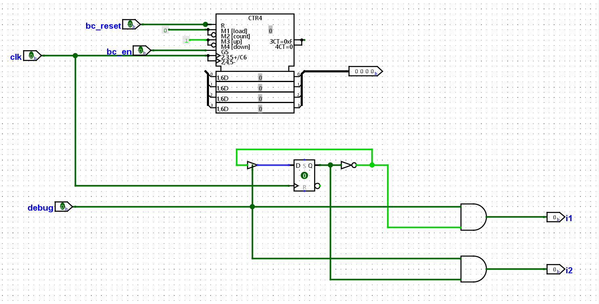  
*Figure 15: Manual/Loader control with handshake signals.*

---

## Instruction Set Architecture

### Instruction Encoding Scheme

- **Upper nibble** (`IR[7:4]`): opcode  
- **Lower nibble** (`IR[3:0]`): 4-bit operand/address (if used)

**Opcode map (upper nibble):**  
`LDA=1, LDB=2, ADD=3, SUB=4, STA=5, JMP=6, SHL=7, SHR=8, ROL=9, ROR=A, HLT=F`

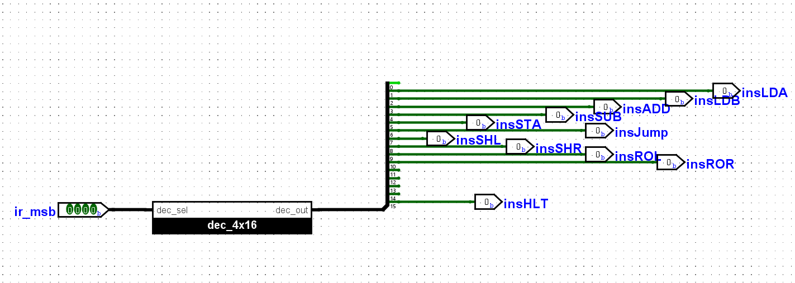  
*Figure 16: Instruction format and opcode mapping.*

#### Table 1: Instruction Set & Program (JMP + ADD Demo)

| Address (bin) | Instruction (bin) | Hex | Mnemonic & Explanation      |
|---|---|---:|---|
| 00000000 | `0001 1101` | **1C** | **LDA 12** — A ← M[12] |
| 00000001 | `0010 1110` | **2D** | **LDB 13** — B ← M[13] |
| 00000010 | `0110 0101` | **65** | **JMP 5** — PC ← 5     |
| 00000011 | `0011 0000` | **30** | **ADD** — A ← A + B    |
| 00000100 | `0101 1111` | **5F** | **STA 15** — M[15] ← A |
| 00000101 | `1111 0000` | **F0** | **HLT** — halt         |

> Matches the assembler output and produces **0x3C (60)** at RAM\[15] for M\[13]=51 (0x33) and M\[14]=25 (0x19).

#### Table 2: Data Values in RAM (for the demo)

| Address (Binary) | Data (Binary) | Decimal | Hex |
|---|---|---:|---:|
| 00001101 | `00110011` | 51 | 33 |
| 00001110 | `00011001` | 25 | 19 |

### Shift/Rotate Programs (single-cycle execute at T4)

**Table 3A: SHL by 1** (addr 14 = 25 → result 50)

| Addr | Bin | Hex | Explanation |
|---|---|---:|---|
| 00 | `0001 1110` | **1E** | **LDA 14** — load 0x19 |
| 01 | `0111 0000` | **70** | **SHL** — A << 1       |
| 02 | `0101 1111` | **5F** | **STA 15**             |
| 03 | `1111 0000` | **F0** | **HLT**                |

**HEX (16B)**: `1E 70 5F F0 00 00 00 00 00 00 00 00 23 19 00 00`  
**Expected**: RAM\[15] = **0x32 (50)**

**Table 3B: SHR by 1** (addr 14 = 25 → result 12)

| Addr | Bin | Hex | Explanation |
|---|---|---:|---|
| 00 | `0001 1110` | **1E** | LDA 14 |
| 01 | `1000 0000` | **80** | **SHR** — A >> 1 |
| 02 | `0101 1111` | **5F** | STA 15 |
| 03 | `1111 0000` | **F0** | HLT    |

**HEX (16B)**: `1E 80 5F F0 00 00 00 00 00 00 00 00 23 19 00 00`  
**Expected**: RAM\[15] = **0x0C (12)**

**Table 3C: ROL by 1** (use `ORG 13 / DEC 129` → 0x81)

| Addr | Bin | Hex | Explanation |
|---|---|---:|---|
| 00 | `0001 1101` | **1D** | **LDA 13** — A ← 0x81 |
| 01 | `1001 0000` | **90** | **ROL** — rotate left 1 |
| 02 | `0101 1111` | **5F** | STA 15 |
| 03 | `1111 0000` | **F0** | HLT    |

**HEX (16B)**: `1D 90 5F F0 00 00 00 00 00 00 00 00 81 19 00 00`  
**Expected**: RAM\[15] = **0x03**

**Table 3D: ROR by 1** (use 0x81 at addr 13)

| Addr | Bin | Hex | Explanation |
|---|---|---:|---|
| 00 | `0001 1101` | **1D** | **LDA 13** — A ← 0x81 |
| 01 | `1010 0000` | **A0** | **ROR** — rotate right 1 |
| 02 | `0101 1111` | **5F** | STA 15 |
| 03 | `1111 0000` | **F0** | HLT    |

**HEX (16B)**: `1D A0 5F F0 00 00 00 00 00 00 00 00 81 19 00 00`  
**Expected**: RAM\[15] = **0xC0**

---

## Assembler

The web assembler converts **SAP-1 assembly** to **Logisim-ready hex** (`v2.0 raw`), supporting **LDA, LDB, ADD, SUB, STA, JMP, HLT**, and directives like **ORG/DEC**—eliminating manual conversion errors.

🔗 **[Open the SAP-1 Assembler Tool](https://htmlpreview.github.io/?https://github.com/Maitri346/SAP-1-Architecture-Logisim/blob/main/SAP_1_Assembler_35.html)**

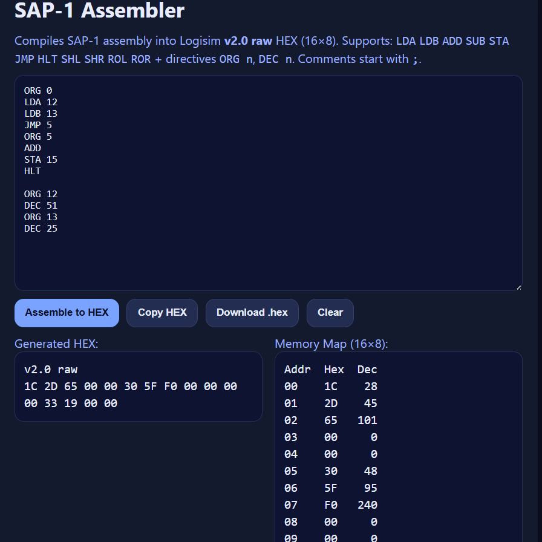  
*Figure 17: Web-based assembler generating hex for Logisim.*

---

## Operation

The CPU advances through the **fetch–decode–execute** cycle under clock control.

### Fetch–Decode–Execute Cycle

**Fetch**
- **T1**: PC → bus, **MAR** latches.
- **T2**: **M[MAR]** → bus, **IR** latches.
- **T3**: **PC** increments.

**Decode**
- **IR[7:4]** → decoder; timing state (T-state) + opcode determine control lines.

**Execute**
- Control lines drive the required micro-ops.
- Typical latencies: LDA ≈ 2 states (beyond fetch), ADD ≈ 2, HLT finishes immediately.
- Execution proceeds until **HLT**; ring counter halts.

---

### Running the CPU in Manual Mode

**Initial Setup**
- `debug` LOW to enable automated control (then set HIGH to enter loader).
- Pulse `pc_reset` to zero the PC.
- Ensure `clk1` is OFF; `en_run` HIGH to permit stepping.

**Per instruction/data (loader)**
- Set address via `debug_data`.
- Pulse `mar_in_en_manual` to load MAR.
- Set value via `debug_data`.
- Pulse `ram_wr_manual` to write RAM.

**After loading**
- Set `debug` LOW.
- Pulse `pc_reset` to start from address 0000.

**Run**
- **Manual stepping**: press `clk` to step the cycle, observing PC/MAR/IR/A/B/RAM.
- **Continuous run**: enable continuous clock for automatic execution.

**HLT**
- CPU halts on HLT; state counter stops.

**Verify**
- Check RAM address **15 (0b00001111)**. Expect **0x3C (60)** for the ADD demo.

---

### SAP-1 CPU Circuit Implementation

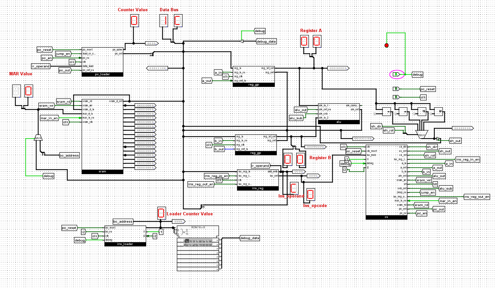  
*Figure 18: CPU in Logisim Evolution—debug pins, control, RAM verification.*

### Running the CPU in Automatic Mode (JMP + ADD Program)

**1) Initial Setup**
- `debug` LOW; `clk1` OFF.
- Pulse `pc_reset` to 0000.

**2) Program the ROM**
- Right-click ROM → **Edit Contents…**
- Enter hex at address 0000:  
1D 2E 65 00 30 5F F0 00 00 00 00 00 23 19 00 00

**3) Load Program to RAM (Bootloader Mode)**
- Set `debug` HIGH (Code Loading Mode LED ON).
- Pulse `clk` to copy ROM → RAM (two pulses per byte).
- Observe MAR and bus on 7-segment displays.

**4) Stop the Bootloader**
- Set `debug` LOW.
- Pulse `clk` once to safely end the loader.

**5) Run**
- Pulse `pc_reset` (PC = 0000).
- Provide clock pulses (manual/continuous) to execute.
- Monitor PC, MAR, IR, A, B through the cycle.

**6) Execution Sequence**
- LDA(13) → A  
- LDB(14) → B  
- JMP 5 → PC  
- ADD → A ← A + B  
- STA(15) → M[15] ← A  
- HLT

**7) Verify**
- RAM\[15] = **0x3C (60)** (sum of 0x23 and 0x19).

### SAP-1 CPU Execution (Automatic Mode)

**After loading program/data into RAM**  
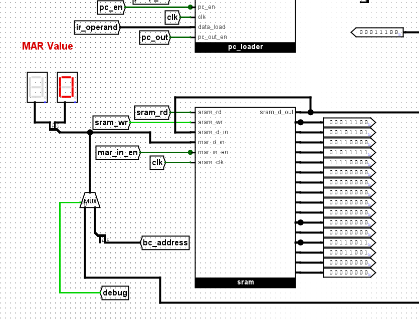  
*Figure 19: Post-load state.*

**After executing LDA 13**  
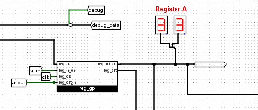  
*Figure 20: Register A ← 35 (from address 13).*

**After executing LDB 14**  
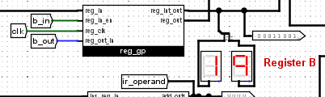  
*Figure 21: Register B ← 25 (from address 14).*

**After executing JMP 5**  
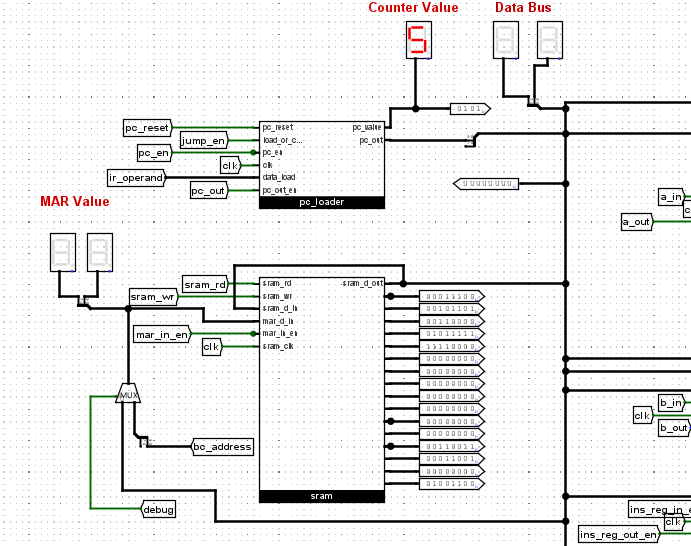  
*Figure 22: PC updated to address 5.*

**After executing STA 15**  
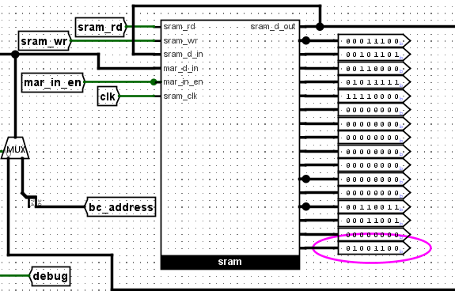  
*Figure 23: Result (60) written to RAM[15].*

**After executing SUB (example)**  
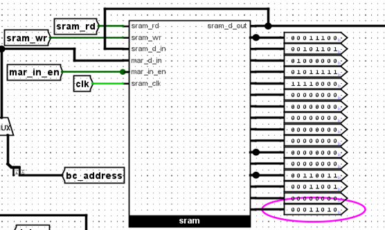  
*Figure 24: SUB result shown at the destination (demo view).*

**After executing JMP (example)**  
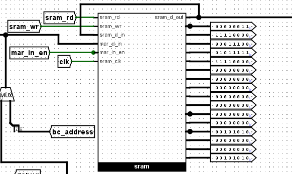  
*Figure 25: Jump instruction executed.*

**After executing SHL (example)**  
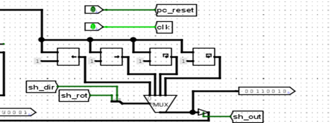  
*Figure 26: SHL output displayed.*

**After executing SHL, SHR, ROL, ROR**  
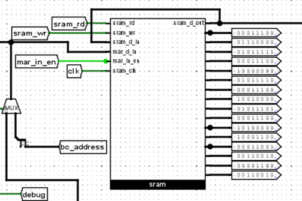  
*Figure 27: Results verified in RAM/output.*

---

## Future Improvement

- **Status Flags**: introduce **Z** (Zero) and **C** (Carry) for conditional branches (e.g., JZ, JC).
- **Memory & ISA**: larger address space, immediate forms, richer instruction formats.
- **Microcoded Control**: scalable ISA expansion.
- **Assembler Enhancements**: labels, expressions, richer directives.

---

## Conclusion

This enhanced SAP-1 bridges classical CPU design with modern simulation-based education. With **dual modes**, an **extended ISA**, and a clear **control sequencer**, the system demonstrates technical correctness and pedagogical clarity. Verified programs confirm proper execution, timing, and control flow—providing a strong foundation for further study and extensions in VLSI and digital system design.

---
